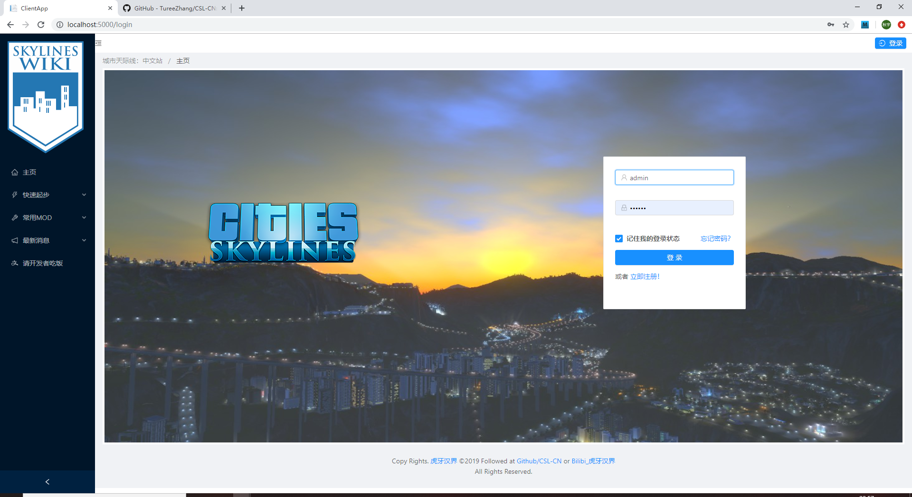

# CSL-CN

## 概述

城市天际线中文站点，虎牙汉界，开源项目。 <http://www.cities-skylines.cn>

## 技术框架

**服务器端：**

- [.Net Core 2.2 Web API](https://docs.microsoft.com/zh-cn/aspnet/?view=aspnetcore-2.2#pivot=core)
- [EF Core 2.2](https://docs.microsoft.com/zh-cn/ef/core/index)

**客户端：**

- [Angular 7.2](https://www.angular.cn/)
- [Ng-Zorro](https://ng.ant.design/)

## Beta 版当前预览 20191210




## 常见命令与问题解决

1.修改数据模型后执行以下操作，更新数据库模型。

```cmd
Add-Migration InitialCreate //修改 "InitialCreate" 为本次调整的详细说明
Update-Database
```

a.如果执行以上命令出现异常:

``
An item with the same key has already been added. Key: Pomelo.EntityFrameworkCore.MySql.Infrastructure.Internal.MySqlOptionsExtension``

则注释 CSLDbContext 下的 OnConfiguring 方法，仅保留 base. 一行。

b.如果出现 BuildFail：

则 Ctrl+Shift+B 重新生成项目，再根据编译器的错误提示修正 CSL-CN 项目内报红线的语法错误。


2.Angular 项目中使用装饰器出现编译器错误提示。

卸载项目 -> 右键编辑项目文件 -> 增加以下配置行以取消错误提示。

```xml
 <PropertyGroup Condition="'$(Configuration)' == 'Debug'">
     ....
    <TypeScriptExperimentalDecorators>true</TypeScriptExperimentalDecorators
  </PropertyGroup>
```

 see also: https://github.com/Microsoft/TypeScript/issues/3934
 
 ## 前端快速提示
 
 1.栅格列定位
 
 - 首先使用 nzType="flex" 支持弹性布局。
 
 - 水平对齐方式 nzJustify="start,center,end,space-between,space-around"
 
 - 垂直对齐方式 nzAlign="top,middle,bottom"
 
 see also : https://ng.ant.design/components/grid/zh

## MySql 常见问题

1. MySql80 服务无法启动

https://www.cnblogs.com/RayWang/p/9347874.html
